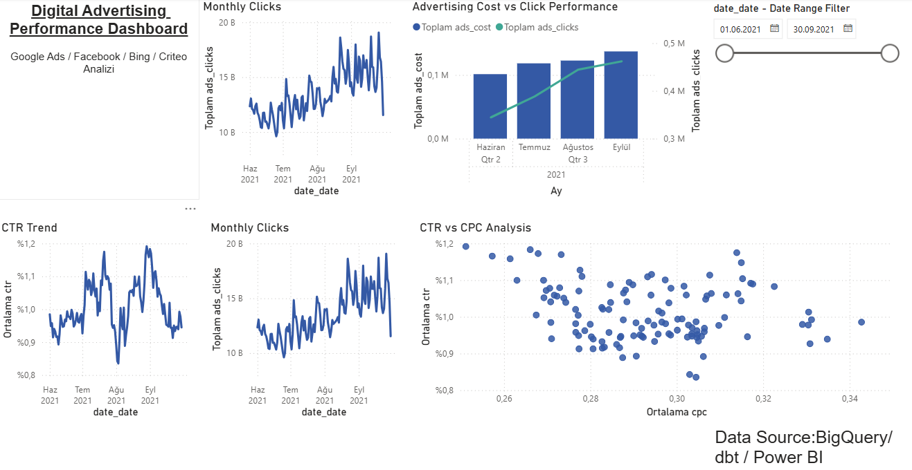

# Digital Advertising Performance Dashboard

Power BI dashboard project built using BigQuery + dbt.

## Tech Stack

- Power BI
- Google BigQuery
- dbt
- SQL

## Dashboard Features

- CTR Trend Analysis
- CPC vs CTR Analysis
- Monthly Click Analysis
- Advertising Cost vs Click Performance
- Interactive Date Filtering

## Data Source

Marketing campaign performance dataset.

## Dashboard Preview

## Project Goal

Analyze digital advertising performance across multiple channels such as:

- Google Ads
- Facebook Ads
- Bing Ads
- Criteo

and create an interactive BI dashboard for marketing analytics.

## Advanced Marketing Metrics

Additional advanced KPIs built using dbt + SQL:

- ROAS (Return on Ad Spend)
- CPA (Cost per Acquisition)
- Conversion Rate
- Revenue Trend Analysis
- Marketing Performance KPIs

## Final Dashboard

